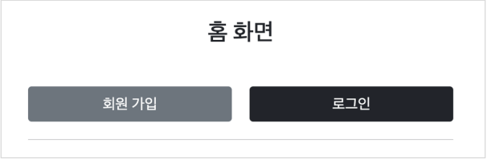
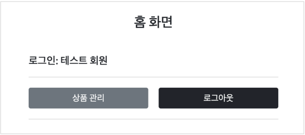
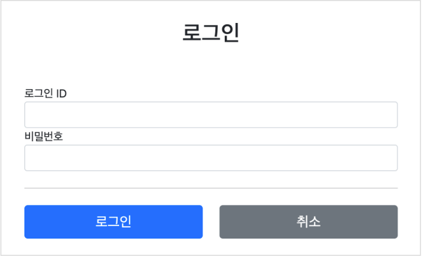
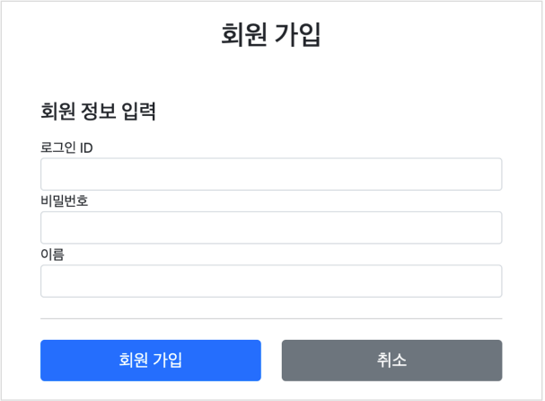

# 로그인 처리 1 - 쿠키, 세션

## 로그인 요구사항

### 홈 화면 - 로그인 전



* 회원 가입
* 로그인

### 홈 화면 - 로그인 후



* 본인 이름 (XX님 환영합니다.)
* 상품 관리
* 로그 아웃

### 보안 요구사항



* 로그인 사용자만 상품에 접근하고, 관리할 수 있음
* 로그인 하지 않은 사용자가 상품 관리에 접근하면 로그인 화면으로 이동

### 회원 가입



### 상품 관리


## 프로젝트 생성

### package 구조

- hello.login
    - domain
        - item
        - login
        - member
    - dto
        - item
    - web
        - item
        - login
        - member

### 도메인이 가장 중요하다.

> 도메인 = 화면, UI, 기술 인프라 등등의 영역은 제외한 시스템이 구현해야 하는 핵심 비즈니스 업무 영역을 말함.

향후 web을 다른 기술로 바꾸어도 도메인은 그대로 유지할 수 있어야 한다.
이렇게 하려면 web은 domain을 알고있지만 domain은 web을 모르도록 설계해야 한다.
이것을 web은 domain을 의존하지만, domain은 web을 의존하지 않는다고 표현한다.
예를 들어 web 패키지를 모두 삭제해도 domain에는 전혀 영향이 없도록 의존관계를 설계하는 것이 중요하다.
반대로 이야기하면 domain은 web을 참조하면 안된다.

## 홈 화면

### HomeController

```java

@Controller
public class HomeController {
    @GetMapping("/")
    public String home() {
        return "home";
    }
}
```

### home.html

```html
<!DOCTYPE html>
<html xmlns:th="http://www.thymeleaf.org">
<head>
    <meta charset="utf-8">
    <link href="css/bootstrap.min.css" rel="stylesheet" th:href="@{/css/bootstrap.min.css}">
</head>
<body>
<div class="container" style="max-width: 600px">
    <div class="text-center py-5">
        <h2>홈 화면</h2>
    </div>

    <div class="row">
        <div class="col">
            <button class="w-100 btn btn-secondary btn-lg" th:onclick="|location.href='@{/members/add}'|" type="button">
                회원 가입
            </button>
        </div>
        <div class="col">
            <button class="w-100 btn btn-dark btn-lg"
                    onclick="location.href='items.html'"
                    th:onclick="|location.href='@{/login}'|"
                    type="button">
                로그인
            </button>
        </div>
    </div>
    <hr class="my-4">
</div> <!-- /container -->
</body>
</html>
```

## 회원 가입

### Member

```java

@Setter
@Getter
public class Member {
    private Long id;

    @NotEmpty
    private String loginId; // 로그인 ID

    @NotEmpty
    private String name;    // 사용자 이름

    @NotEmpty
    private String password;

    public Member(String loginId, String name, String password) {
        this.loginId = loginId;
        this.name = name;
        this.password = password;
    }
}
```

### MemberRepository

```java
/**
 * 동시성 문제가 고려되어 있지 않음.
 * 실무에서는 ConcurrentHashMap, AtomicLong 사용 고려
 */
@Slf4j
@Repository
public class MemberRepository {
    private static final Map<Long, Member> store = new HashMap<>();
    private static long sequence = 0L;

    /**
     * 저장
     *
     * @param member: 저장할 Member 객체
     * @return 저장된 Member
     */
    public Member save(Member member) {
        member.setId(++sequence);
        log.info("Member save: {}", member);
        store.put(member.getId(), member);
        return member;
    }

    /**
     * Member.loginId 가 아닌, Member.id 를 기반으로 찾음
     *
     * @param id: Member.id
     * @return 찾은 Member
     */
    public Member findById(Long id) {
        return store.get(id);
    }

    /**
     * Member.id 가 아닌, Member.loginId
     *
     * @param loginId: Member.loginId
     * @return 찾은 Member
     */
    public Optional<Member> findByLongId(String loginId) {
        return findAll().stream()
                .filter(m -> m.getLoginId().equals(loginId))
                .findFirst();
    }

    /**
     * 저장된 모든 Member List 를 새로 생성해서 반환
     *
     * @return 저장된 모든 Member List
     */
    public List<Member> findAll() {
        return new ArrayList<>(store.values());
    }

    /**
     * 저장된 모든 Member 제거, 테스트 용도
     */
    public void clearStore() {
        store.clear();
    }
}
```

### MemberController

```java

@Controller
@RequiredArgsConstructor
@RequestMapping("/members")
public class MemberController {
    private final MemberRepository memberRepository;

    @GetMapping("/add")
    public String addForm(
            @ModelAttribute("member") Member member
    ) {
        return "members/addMemberForm";
    }

    @PostMapping("/add")
    public String save(
            @Validated @ModelAttribute Member member,
            BindingResult bindingResult
    ) {
        if (bindingResult.hasErrors()) {
            return "members/addMemberForm";
        }

        return "redirect:/";
    }
}
```

### addMemberForm.html

```html
<!DOCTYPE html>
<html xmlns:th="http://www.thymeleaf.org">
<head>
    <meta charset="utf-8">
    <link href="../css/bootstrap.min.css"
          rel="stylesheet" th:href="@{/css/bootstrap.min.css}">
    <link href="../css/main.css"
          rel="stylesheet" th:href="@{/css/main.css}">
</head>
<body>
<div class="container">
    <div class="py-5 text-center">
        <h2>회원 가입</h2>
    </div>
    <h4 class="mb-3">회원 정보 입력</h4>
    <form action="" method="post" th:action th:object="${member}">
        <div th:if="${#fields.hasGlobalErrors()}">
            <p class="field-error"
               th:each="err : ${#fields.globalErrors()}"
               th:text="${err}"
            >전체 오류 메시지</p>
        </div>
        <div>
            <label for="loginId">로그인 ID</label>
            <input class="form-control"
                   id="loginId"
                   th:errorclass="field-error"
                   th:field="*{loginId}"
                   type="text">
            <div class="field-error" th:errors="*{loginId}"/>
        </div>
        <div>
            <label for="password">비밀번호</label>
            <input class="form-control"
                   id="password"
                   th:errorclass="field-error"
                   th:field="*{password}"
                   type="password">
            <div class="field-error" th:errors="*{password}"/>
        </div>
        <div>
            <label for="name">이름</label>
            <input class="form-control"
                   id="name"
                   th:errorclass="field-error"
                   th:field="*{name}"
                   type="text">
            <div class="field-error" th:errors="*{name}"/>
        </div>
        <hr class="my-4">
        <div class="row">
            <div class="col">
                <button class="w-100 btn btn-primary btn-lg" type="submit">
                    회원 가입
                </button>
            </div>
            <div class="col">
                <button class="w-100 btn btn-secondary btn-lg"
                        onclick="location.href='items.html'"
                        th:onclick="|location.href='@{/}'|"
                        type="button">
                    취소
                </button>
            </div>
        </div>
    </form>
</div> <!-- /container -->
</body>
</html>
```

### TestDataInit

```java

@Component
@RequiredArgsConstructor
public class TestDataInit {
    private final ItemRepository itemRepository;
    private final MemberRepository memberRepository;

    /**
     * 테스트용 데이터 추가
     */
    @PostConstruct
    public void init() {
        // 아이템
        itemRepository.save(new Item("itemA", 10000, 10));
        itemRepository.save(new Item("itemB", 20000, 20));

        // 맴버
        memberRepository.save(new Member("test", "테스터", "test!"));
    }
}
```

## 로그인 기능

### LoginService

```java

@Slf4j
@Service
@RequiredArgsConstructor
public class LoginService {
    private final MemberRepository memberRepository;

    /**
     * 로그인 비즈니스 로직
     *
     * @param loginId:  로그인 ID
     * @param password: 로그인 비밀번호
     * @return 성공: 로그인된 Member, 실패: null
     */
    public Member login(String loginId, String password) {
        log.info("LoginService: '{}', '{}'", loginId, password);
        return memberRepository.findByLongId(loginId)
                .filter(m -> m.getPassword().equals(password))
                .orElse(null);
    }
}
```

### LoginDto

```java

@Setter
@Getter
public class LoginDto {
    @NotEmpty
    private String loginId;

    @NotEmpty
    private String password;

    public LoginForm(String loginId, String password) {
        this.loginId = loginId;
        this.password = password;
    }
}
```

### LoginController

```java

@Slf4j
@Controller
@RequiredArgsConstructor
public class LoginController {
    private final LoginService loginService;

    @GetMapping("/login")
    public String loginForm(
            @ModelAttribute("loginForm") LoginDto form
    ) {
        return "login/loginForm";
    }

    @PostMapping("/login")
    public String login(
            @Validated @ModelAttribute("loginForm") LoginDto form,
            BindingResult bindingResult
    ) {
        if (bindingResult.hasErrors()) {
            return "login/loginForm";
        }

        // 로그인 시도
        Member loginMember = loginService.login(form.getLoginId(), form.getPassword());
        log.info("login? {}", loginMember);

        // 로그인 실패 시
        if (loginMember == null) {
            bindingResult.reject("loginFail", "아이디 또는 비밀번호가 맞지 않습니다.");
            return "login/loginForm";
        }

        // TODO: 로그인 성공 처리

        return "redirect:/";
    }
}
```

### loginForm.html

```html
<!DOCTYPE HTML>
<html xmlns:th="http://www.thymeleaf.org">
<head>
    <meta charset="utf-8">
    <link href="../css/bootstrap.min.css"
          rel="stylesheet" th:href="@{/css/bootstrap.min.css}">
    <link href="../css/main.css"
          rel="stylesheet" th:href="@{/css/main.css}">
</head>
<body>
<div class="container">
    <div class="py-5 text-center">
        <h2>로그인</h2>
    </div>
    <form action="item.html" method="post" th:action th:object="${loginForm}">
        <div th:if="${#fields.hasGlobalErrors()}">
            <p class="field-error" th:each="err : ${#fields.globalErrors()}"
               th:text="${err}">전체 오류 메시지</p>
        </div>
        <div>
            <label for="loginId">로그인 ID</label>
            <input class="form-control"
                   id="loginId"
                   th:errorclass="field-error"
                   th:field="*{loginId}"
                   type="text">
            <div class="field-error" th:errors="*{loginId}"/>
        </div>
        <div>
            <label for="password">비밀번호</label>
            <input class="form-control"
                   id="password"
                   th:errorclass="field-error"
                   th:field="*{password}"
                   type="password">
            <div class="field-error" th:errors="*{password}"/>
        </div>
        <hr class="my-4">
        <div class="row">
            <div class="col">
                <button class="w-100 btn btn-primary btn-lg" type="submit">
                    로그인
                </button>
            </div>
            <div class="col">
                <button class="w-100 btn btn-secondary btn-lg"
                        onclick="location.href='items.html'"
                        th:onclick="|location.href='@{/}'|"
                        type="button">취소
                </button>
            </div>
        </div>
    </form>
</div> <!-- /container -->
</body>
</html>
```

### 실행

실행해보면 로그인이 성공하면 홈으로 이동하고,
로그인에 실패하면 "아이디 또는 비밀번호가 맞지 않습니다."라는 경고와 함께 로그인 폼이 나타난다.

그런데 아직 로그인이 되면 홈 화면에 고객 이름이 보여야 한다는 요구사항을 만족하지 못한다.
로그인의 상태를 유지하면서, 로그인에 성공한 사용자는 홈 화면에 접근시 고객의 이름을 보여주려면 어떻게 해야할까?

## 로그인 처리하기 - 쿠키 사용

## 쿠키와 보안 문제

## 로그인 처리하기 - 세션 동작 방식

## 로그인 처리하기 - 세션 직접 만들기

## 로그인 처리하기 - 직접 만든 세션 적용

## 로그인 처리하기 - 서블릿 HTTP 세션 1

## 로그인 처리하기 - 서블릿 HTTP 세션 2

## 세션 정보와 타임아웃 설정