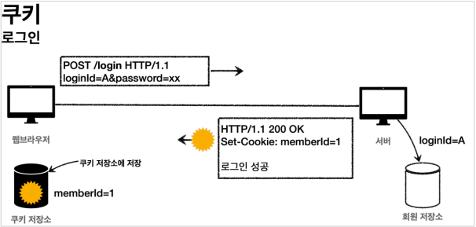
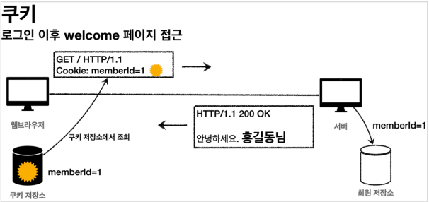
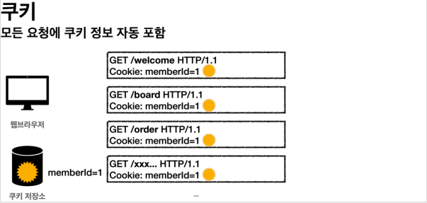
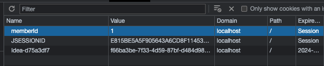
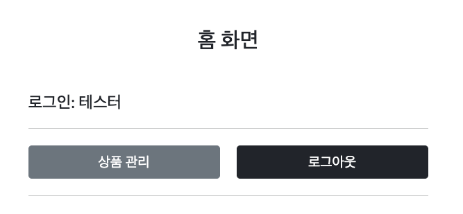
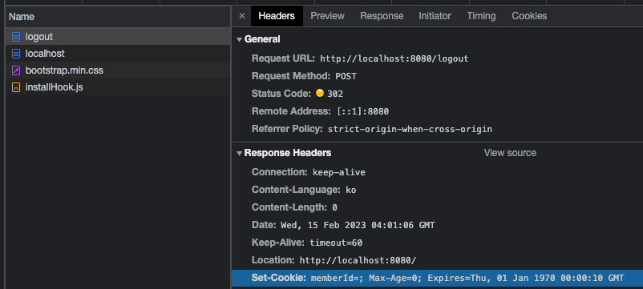
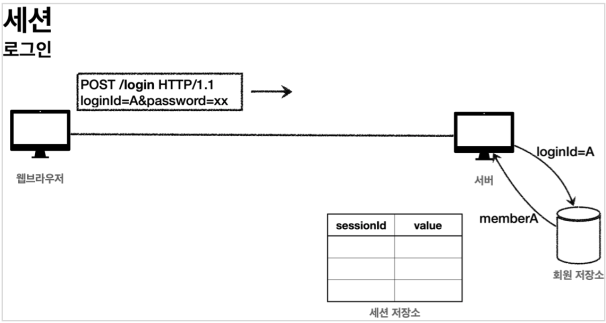
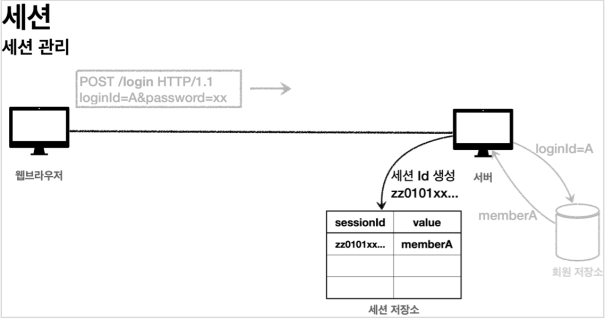
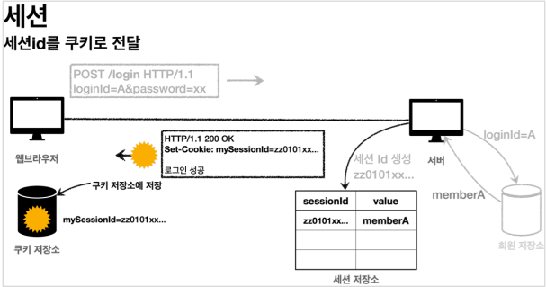
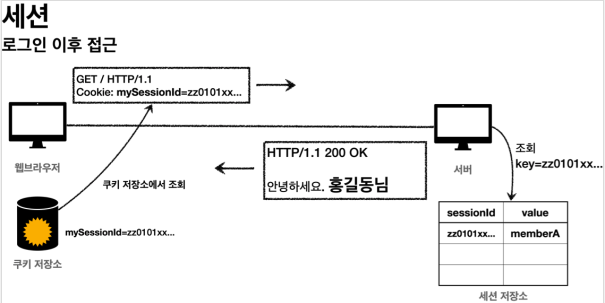

# 로그인 처리 1 - 쿠키, 세션

## 로그인 요구사항

### 홈 화면 - 로그인 전


* 회원 가입
* 로그인

### 홈 화면 - 로그인 후


* 본인 이름 (XX님 환영합니다.)
* 상품 관리
* 로그 아웃

### 보안 요구사항


* 로그인 사용자만 상품에 접근하고, 관리할 수 있음
* 로그인 하지 않은 사용자가 상품 관리에 접근하면 로그인 화면으로 이동

### 회원 가입


### 상품 관리


## 프로젝트 생성

### package 구조

- hello.login
    - domain
        - item
        - login
        - member
    - dto
        - item
    - web
        - item
        - login
        - member

### 도메인이 가장 중요하다.

> 도메인 = 화면, UI, 기술 인프라 등등의 영역은 제외한 시스템이 구현해야 하는 핵심 비즈니스 업무 영역을 말함.

향후 web을 다른 기술로 바꾸어도 도메인은 그대로 유지할 수 있어야 한다.
이렇게 하려면 web은 domain을 알고있지만 domain은 web을 모르도록 설계해야 한다.
이것을 web은 domain을 의존하지만, domain은 web을 의존하지 않는다고 표현한다.
예를 들어 web 패키지를 모두 삭제해도 domain에는 전혀 영향이 없도록 의존관계를 설계하는 것이 중요하다.
반대로 이야기하면 domain은 web을 참조하면 안된다.

## 홈 화면

### HomeController

```java

@Controller
public class HomeController {
    @GetMapping("/")
    public String home() {
        return "home";
    }
}
```

### home.html

```html
<!DOCTYPE html>
<html xmlns:th="http://www.thymeleaf.org">
<head>
    <meta charset="utf-8">
    <link href="css/bootstrap.min.css" rel="stylesheet" th:href="@{/css/bootstrap.min.css}">
</head>
<body>
<div class="container" style="max-width: 600px">
    <div class="text-center py-5">
        <h2>홈 화면</h2>
    </div>

    <div class="row">
        <div class="col">
            <button class="w-100 btn btn-secondary btn-lg" th:onclick="|location.href='@{/members/add}'|" type="button">
                회원 가입
            </button>
        </div>
        <div class="col">
            <button class="w-100 btn btn-dark btn-lg"
                    onclick="location.href='items.html'"
                    th:onclick="|location.href='@{/login}'|"
                    type="button">
                로그인
            </button>
        </div>
    </div>
    <hr class="my-4">
</div> <!-- /container -->
</body>
</html>
```

## 회원 가입

### Member

```java

@Setter
@Getter
public class Member {
    private Long id;

    @NotEmpty
    private String loginId; // 로그인 ID

    @NotEmpty
    private String name;    // 사용자 이름

    @NotEmpty
    private String password;

    public Member(String loginId, String name, String password) {
        this.loginId = loginId;
        this.name = name;
        this.password = password;
    }
}
```

### MemberRepository

```java
/**
 * 동시성 문제가 고려되어 있지 않음.
 * 실무에서는 ConcurrentHashMap, AtomicLong 사용 고려
 */
@Slf4j
@Repository
public class MemberRepository {
    private static final Map<Long, Member> store = new HashMap<>();
    private static long sequence = 0L;

    /**
     * 저장
     *
     * @param member: 저장할 Member 객체
     * @return 저장된 Member
     */
    public Member save(Member member) {
        member.setId(++sequence);
        log.info("Member save: {}", member);
        store.put(member.getId(), member);
        return member;
    }

    /**
     * Member.loginId 가 아닌, Member.id 를 기반으로 찾음
     *
     * @param id: Member.id
     * @return 찾은 Member
     */
    public Member findById(Long id) {
        return store.get(id);
    }

    /**
     * Member.id 가 아닌, Member.loginId
     *
     * @param loginId: Member.loginId
     * @return 찾은 Member
     */
    public Optional<Member> findByLongId(String loginId) {
        return findAll().stream()
                .filter(m -> m.getLoginId().equals(loginId))
                .findFirst();
    }

    /**
     * 저장된 모든 Member List 를 새로 생성해서 반환
     *
     * @return 저장된 모든 Member List
     */
    public List<Member> findAll() {
        return new ArrayList<>(store.values());
    }

    /**
     * 저장된 모든 Member 제거, 테스트 용도
     */
    public void clearStore() {
        store.clear();
    }
}
```

### MemberController

```java

@Controller
@RequiredArgsConstructor
@RequestMapping("/members")
public class MemberController {
    private final MemberRepository memberRepository;

    @GetMapping("/add")
    public String addForm(
            @ModelAttribute("member") Member member
    ) {
        return "members/addMemberForm";
    }

    @PostMapping("/add")
    public String save(
            @Validated @ModelAttribute Member member,
            BindingResult bindingResult
    ) {
        if (bindingResult.hasErrors()) {
            return "members/addMemberForm";
        }

        return "redirect:/";
    }
}
```

### addMemberForm.html

```html
<!DOCTYPE html>
<html xmlns:th="http://www.thymeleaf.org">
<head>
    <meta charset="utf-8">
    <link href="../css/bootstrap.min.css"
          rel="stylesheet" th:href="@{/css/bootstrap.min.css}">
    <link href="../css/main.css"
          rel="stylesheet" th:href="@{/css/main.css}">
</head>
<body>
<div class="container">
    <div class="py-5 text-center">
        <h2>회원 가입</h2>
    </div>
    <h4 class="mb-3">회원 정보 입력</h4>
    <form action="" method="post" th:action th:object="${member}">
        <div th:if="${#fields.hasGlobalErrors()}">
            <p class="field-error"
               th:each="err : ${#fields.globalErrors()}"
               th:text="${err}"
            >전체 오류 메시지</p>
        </div>
        <div>
            <label for="loginId">로그인 ID</label>
            <input class="form-control"
                   id="loginId"
                   th:errorclass="field-error"
                   th:field="*{loginId}"
                   type="text">
            <div class="field-error" th:errors="*{loginId}"/>
        </div>
        <div>
            <label for="password">비밀번호</label>
            <input class="form-control"
                   id="password"
                   th:errorclass="field-error"
                   th:field="*{password}"
                   type="password">
            <div class="field-error" th:errors="*{password}"/>
        </div>
        <div>
            <label for="name">이름</label>
            <input class="form-control"
                   id="name"
                   th:errorclass="field-error"
                   th:field="*{name}"
                   type="text">
            <div class="field-error" th:errors="*{name}"/>
        </div>
        <hr class="my-4">
        <div class="row">
            <div class="col">
                <button class="w-100 btn btn-primary btn-lg" type="submit">
                    회원 가입
                </button>
            </div>
            <div class="col">
                <button class="w-100 btn btn-secondary btn-lg"
                        onclick="location.href='items.html'"
                        th:onclick="|location.href='@{/}'|"
                        type="button">
                    취소
                </button>
            </div>
        </div>
    </form>
</div> <!-- /container -->
</body>
</html>
```

### TestDataInit

```java

@Component
@RequiredArgsConstructor
public class TestDataInit {
    private final ItemRepository itemRepository;
    private final MemberRepository memberRepository;

    /**
     * 테스트용 데이터 추가
     */
    @PostConstruct
    public void init() {
        // 아이템
        itemRepository.save(new Item("itemA", 10000, 10));
        itemRepository.save(new Item("itemB", 20000, 20));

        // 맴버
        memberRepository.save(new Member("test", "테스터", "test!"));
    }
}
```

## 로그인 기능

### LoginService

```java

@Slf4j
@Service
@RequiredArgsConstructor
public class LoginService {
    private final MemberRepository memberRepository;

    /**
     * 로그인 비즈니스 로직
     *
     * @param loginId:  로그인 ID
     * @param password: 로그인 비밀번호
     * @return 성공: 로그인된 Member, 실패: null
     */
    public Member login(String loginId, String password) {
        log.info("LoginService: '{}', '{}'", loginId, password);
        return memberRepository.findByLongId(loginId)
                .filter(m -> m.getPassword().equals(password))
                .orElse(null);
    }
}
```

### LoginDto

```java

@Setter
@Getter
public class LoginDto {
    @NotEmpty
    private String loginId;

    @NotEmpty
    private String password;

    public LoginForm(String loginId, String password) {
        this.loginId = loginId;
        this.password = password;
    }
}
```

### LoginController

```java

@Slf4j
@Controller
@RequiredArgsConstructor
public class LoginController {
    private final LoginService loginService;

    @GetMapping("/login")
    public String loginForm(
            @ModelAttribute("loginForm") LoginDto form
    ) {
        return "login/loginForm";
    }

    @PostMapping("/login")
    public String login(
            @Validated @ModelAttribute("loginForm") LoginDto form,
            BindingResult bindingResult
    ) {
        if (bindingResult.hasErrors()) {
            return "login/loginForm";
        }

        // 로그인 시도
        Member loginMember = loginService.login(form.getLoginId(), form.getPassword());
        log.info("login? {}", loginMember);

        // 로그인 실패 시
        if (loginMember == null) {
            bindingResult.reject("loginFail", "아이디 또는 비밀번호가 맞지 않습니다.");
            return "login/loginForm";
        }

        // TODO: 로그인 성공 처리

        return "redirect:/";
    }
}
```

### loginForm.html

```html
<!DOCTYPE HTML>
<html xmlns:th="http://www.thymeleaf.org">
<head>
    <meta charset="utf-8">
    <link href="../css/bootstrap.min.css"
          rel="stylesheet" th:href="@{/css/bootstrap.min.css}">
    <link href="../css/main.css"
          rel="stylesheet" th:href="@{/css/main.css}">
</head>
<body>
<div class="container">
    <div class="py-5 text-center">
        <h2>로그인</h2>
    </div>
    <form action="item.html" method="post" th:action th:object="${loginForm}">
        <div th:if="${#fields.hasGlobalErrors()}">
            <p class="field-error" th:each="err : ${#fields.globalErrors()}"
               th:text="${err}">전체 오류 메시지</p>
        </div>
        <div>
            <label for="loginId">로그인 ID</label>
            <input class="form-control"
                   id="loginId"
                   th:errorclass="field-error"
                   th:field="*{loginId}"
                   type="text">
            <div class="field-error" th:errors="*{loginId}"/>
        </div>
        <div>
            <label for="password">비밀번호</label>
            <input class="form-control"
                   id="password"
                   th:errorclass="field-error"
                   th:field="*{password}"
                   type="password">
            <div class="field-error" th:errors="*{password}"/>
        </div>
        <hr class="my-4">
        <div class="row">
            <div class="col">
                <button class="w-100 btn btn-primary btn-lg" type="submit">
                    로그인
                </button>
            </div>
            <div class="col">
                <button class="w-100 btn btn-secondary btn-lg"
                        onclick="location.href='items.html'"
                        th:onclick="|location.href='@{/}'|"
                        type="button">취소
                </button>
            </div>
        </div>
    </form>
</div> <!-- /container -->
</body>
</html>
```

### 실행

실행해보면 로그인이 성공하면 홈으로 이동하고,
로그인에 실패하면 "아이디 또는 비밀번호가 맞지 않습니다."라는 경고와 함께 로그인 폼이 나타난다.

그런데 아직 로그인이 되면 홈 화면에 고객 이름이 보여야 한다는 요구사항을 만족하지 못한다.
로그인의 상태를 유지하면서, 로그인에 성공한 사용자는 홈 화면에 접근시 고객의 이름을 보여주려면 어떻게 해야할까?

## 로그인 처리하기 - 쿠키 사용

> **참고**<br>
> 여기서는 여러분이 쿠키의 기본 개념을 이해하고 있다고 가정한다.
> 쿠키에 대해서는 [모든 개발자를 위한 HTTP 기본 지식](https://www.inflearn.com/course/http-%EC%9B%B9-%EB%84%A4%ED%8A%B8%EC%9B%8C%ED%81%AC)
> 강의를 참고하자.
> 혹시 잘 생각이 안나면 쿠키 관련 내용을 꼭! 복습하고 돌아오자.

쿠키를 사용해서 로그인, 로그아웃 기능을 구현해보자.

### 로그인 상태 유지하기

로그인의 상태를 어떻게 유지할 수 있을까?
HTTP 강의에서 일부 설명했지만, 쿼리 파라미터를 계속 유지하면서 보내는 것은 매우 어렵고 번거로운 작업이다.
쿠키를 사용해보자.

### 쿠키

서버에서 로그인에 성공하면 HTTP 응답에 쿠키를 담아서 브라우저에 전달하자.
그러면 브라우저는 앞으로 해당 쿠키를 지속해서 보내준다.

#### 쿠키 생성



#### 클라이언트 쿠키 전달 1



#### 클라이언트 쿠키 전달 2



#### 쿠키에는 영속 쿠키와 세션 쿠키가 있다.

* 영속 쿠키: 만료 날짜를 입력하면 해당 날짜까지 유지
* 세션 쿠키: 만료 날짜를 생략하면 브라우저 종료시 까지만 유지

브라우저 종료시 로그아웃이 되길 기대하므로, 우리에게 필요한 것은 세션 쿠키이다.

### LoginController

```java
@PostMapping("/login")
public String login(
        @Validated @ModelAttribute("loginForm") LoginDto form,
        BindingResult bindingResult,
        HttpServletResponse resp
) {
    if (bindingResult.hasErrors()) {
        return "login/loginForm";
    }

    // 로그인 시도
    Member loginMember = loginService.login(form.getLoginId(), form.getPassword());
    log.info("login? {}", loginMember);

    // 로그인 실패 시
    if (loginMember == null) {
        bindingResult.reject("loginFail", "아이디 또는 비밀번호가 맞지 않습니다.");
        return "login/loginForm";
    }

    // 로그인 성공 처리 - 쿠키 생성
    Cookie idCookie = new Cookie("memberId", String.valueOf(loginMember.getId()));
    resp.addCookie(idCookie);

    return "redirect:/";
}
```

#### 쿠키 생성 로직

```java
Cookie idCookie=new Cookie("memberId",String.valueOf(loginMember.getId()));
resp.addCookie(idCookie);
```

로그인에 성공하면 쿠키를 생성하고 `HttpServletResponse` 에 담는다.
쿠키 이름은 `memberId`이고, 값은 **회원의 `id`** 를 담아둔다.
웹 브라우저는 종료 전까지 **회원의 `id`** 를 서버에 계속 보내줄 것이다.

### 실행



### HomeController

```java
@Controller
@RequiredArgsConstructor
public class HomeController {
    private final MemberRepository memberRepository;

    @GetMapping("/")
    public String homeLogin(
            @CookieValue(name = "memberId", required = false) Long memberId,
            Model model
    ) {
        if (memberId == null) {
            return "home";
        }

        // 로그인
        Member loginMember = memberRepository.findById(memberId);
        if (loginMember == null) {
            return "home";
        }

        model.addAttribute("member", loginMember);
        return "loginHome";
    }
}
```

* `@CookieValue`를 사용하면 편리하게 쿠키를 조회할 수 있다.
* 로그인 하지 않은 사용자도 홈에 접근할 수 있기 때문에, `required = false`를 사용한다.

### loginHome.html

```html
<!DOCTYPE HTML>
<html xmlns:th="http://www.thymeleaf.org">
<head>
    <meta charset="utf-8">
    <link href="../css/bootstrap.min.css"
          rel="stylesheet" th:href="@{/css/bootstrap.min.css}">
</head>
<body>
<div class="container" style="max-width: 600px">
    <div class="py-5 text-center">
        <h2>홈 화면</h2>
    </div>
    <h4 class="mb-3" th:text="|로그인: ${member.name}|">로그인 사용자 이름</h4>
    <hr class="my-4">
    <div class="row">
        <div class="col">
            <button class="w-100 btn btn-secondary btn-lg"
                    th:onclick="|location.href='@{/items}'|"
                    type="button">
                상품 관리
            </button>
        </div>
        <div class="col">
            <form method="post" th:action="@{/logout}">
                <button class="w-100 btn btn-dark btn-lg" type="submit">
                    로그아웃
                </button>
            </form>
        </div>
    </div>
    <hr class="my-4">
</div> <!-- /container -->
</body>
</html>
```

### 실행



로그인에 성공하면 사용자 이름이 출력되면서 상품 관리, 로그아웃 버튼을 확인할 수 있다.
로그인에 성공시 세션 쿠키가 지속해서 유지되고, 웹 브라우저에서 서버에 요청시 memberId 쿠키를 계속 보내준다.

### 로그아웃 - LoginController

```java
private void expireCookie(
        HttpServletResponse resp,
        String cookieName
) {
    // 쿠키의 만료 시간을 0으로 만든다.
    Cookie cookie = new Cookie(cookieName, null);
    cookie.setMaxAge(0);
    resp.addCookie(cookie);
}

@PostMapping("/logout")
public String logout(
        HttpServletResponse resp
) {
    expireCookie(resp, "memberId");
    return "redirect:/";
}
```

### 실행



로그아웃도 응답 쿠키를 생성하는데 `Max-Age=0` 를 확인할 수 있다. 해당 쿠키는 즉시 종료된다.

## 쿠키와 보안 문제

쿠키를 사용해서 로그인 Id를 전달해서 로그인을 유지할 수 있었다.
그런데 여기에는 심각한 보안 문제가 있다.

### 보안 문제

* 쿠키 값은 **임의로 변경할 수 있다.**
    * 클라이언트가 쿠키를 강제로 변경하면 다른 사용자가 된다.
    * 실제 웹브라우저 개발자모드 Application Cookie 변경으로 확인
    * Cookie: memberId=1 Cookie: memberId=2 (다른 사용자의 이름이 보임)
* 쿠키에 보관된 정보는 **훔쳐갈 수 있다.**
    * 만약 쿠키에 개인정보나, 신용카드 정보가 있다면?
    * 이 정보가 웹 브라우저에도 보관되고, 네트워크 요청마다 계속 클라이언트에서 서버로 전달된다.
    * 쿠키의 정보가 나의 로컬 PC에서 털릴 수도 있고, 네트워크 전송 구간에서 털릴 수도 있다.
* **해커가 쿠키를 한번 훔쳐가면 평생 사용할 수 있다.**
    * 해커가 쿠키를 훔쳐가서 그 쿠키로 악의적인 요청을 계속 시도할 수 있다.

### 대안

* 쿠키에 중요한 값을 노출하지 않고, 사용자 별로 예측 불가능한 임의의 토큰(랜덤 값)을 노출하고,
  서버에서 토큰과 사용자 id를 매핑해서 인식한다.
  그리고 **서버에서 토큰을 관리**한다.
* 토큰은 해커가 임의의 값을 넣어도 찾을 수 없도록 **예상 불가능** 해야 한다.
* 해커가 토큰을 털어가도 시간이 지나면 사용할 수 없도록 서버에서 해당 토큰의 **만료시간을 짧게**(예: 30분)유지한다.
  또는 해킹이 의심되는 경우 **서버에서 해당 토큰을 강제로 제거**하면 된다.

## 로그인 처리하기 - 세션 동작 방식

### 목표

앞서 쿠키에 중요한 정보를 보관하는 방법은 여러가지 보안 이슈가 있었다.
이 문제를 해결하려면 결국 중요한 정보를 모두 서버에 저장해야 한다.
그리고 클라이언트와 서버는 추정 불가능한 임의의 식별자 값으로 연결해야 한다.

이렇게 서버에 중요한 정보를 보관하고 연결을 유지하는 방법을 **세션**이라 한다.

### 세션 동작 방식

#### 로그인



* 사용자가 `loginId`, `password` 정보를 전달하면 서버에서 해당 사용자가 맞는지 확인한다.

#### 세션 생성



* 세션 ID를 생성하는데, 추정 불가능해야 한다.
* **UUID는 추정이 불가능하다.**
    * `Cookie: mySessionId=zz0101xx-bab9-4b92-9b32-dadb280f4b61`
* 생성된 세션 ID와 세션에 보관할 값(`memberA`)을 서버의 세션 저장소에 보관한다.

#### 세션 ID를 응답 쿠키로 전달



**클라이언트와 서버는 결국 쿠키로 연결이 되어야 한다.**

* 서버는 클라이언트에 `mySessionId`라는 이름으로 세션 ID만 쿠키에 담아서 전달한다.
* 클라이언트는 쿠키 저장소에 `mySessionId` 쿠키를 보관한다.

> 중요<br>
> * 여기서 중요한 포인트는 회원과 관련된 정보는 전혀 클라이언트에 전달하지 않는다는 것이다.
> * 오직 추정 불가능한 세션 ID만 쿠키를 통해 클라이언트에 전달한다.

#### 클라이언트의 세션 ID 쿠키 전달



* 클라이언트는 요청시 항상 `meSessionId` 쿠키를 전달한다.
* 서버에서는 클라이언트가 전달한 `mySessionId` 쿠키 정보로 세션 저장소를 조회해서 로그인시 보관한 세션 정보를 사용한다.

### 정리

세션을 사용해서 서버에서 중요한 정보를 관리하게 되었다.
덕분에 다음과 같은 보안 문제들을 해결할 수 있다.

* 쿠키 값 변조 가능
    * 예상 불가능한 복잡한 세션Id를 사용한다.
* 쿠키에 보관하는 정보는 클라이언트 해킹시 털릴 가능성이 있다.
    * 세션Id가 털려도 여기에는 중요한 정보가 없다.
* 쿠키 탈취 후 사용
    * 해커가 토큰을 털어가도 시간이 지나면 사용할 수 없도록 서버에서 세션의 만료시간을 짧게(예: 30분) 유지한다.
    * 또는 해킹이 의심되는 경우 서버에서 해당 세션을 강제로 제거하면 된다.

## 로그인 처리하기 - 세션 직접 만들기

세션을 직접 개발해서 적용해보자.

세션 관리는 크게 다음 3가지 기능을 제공하면 된다.

* **세션 생성**
    * sessionId 생성 (임의의 추정 불가능한 랜덤 값)
    * 세션 저장소에 sessionId와 보관할 값 저장
    * sessionId로 응답 쿠키를 생성해서 클라이언트에 전달
* **세션 조회**
    * 클라이언트가 요청한 sessionId 쿠키의 값으로, 세션 저장소에 보관한 값 조회
* **세션 만료**
    * 클라이언트가 요청한 sessionId 쿠키의 값으로, 세션 저장소에 보관한 sessionId와 값 제거

### SessionManager

```java
/**
 * 세션 관리 매니저
 */
@Component
public class SessionManager {
    public static final String SESSION_COOKIE_NAME = "mySessionId";

    private final Map<String, Object> sessionStore = new ConcurrentHashMap<>();

    /**
     * 세션 생성
     *
     * @param value 저장할 값
     * @param resp  HTTP Servlet Response
     */
    public void createSession(
            Object value,
            HttpServletResponse resp
    ) {
        // 세션 ID를 생성하고, 값을 세션에 저장
        String sessionId = UUID.randomUUID().toString();
        sessionStore.put(sessionId, value);

        // 쿠키 생성
        Cookie mySessionCookie = new Cookie(SESSION_COOKIE_NAME, sessionId);
        resp.addCookie(mySessionCookie);
    }

    /**
     * 세션 조회
     *
     * @param req HTTP Servlet Request
     * @return 조회된 세션에 대한 정보(값)
     */
    public Object getSession(
            HttpServletRequest req
    ) {
        return findCookie(req, SESSION_COOKIE_NAME)
                .map(value -> sessionStore.get(value.getValue()))
                .orElse(null);
    }

    /**
     * 세션 만료
     *
     * @param req HTTP Servlet Request
     */
    public void expire(
            HttpServletRequest req
    ) {
        findCookie(req, SESSION_COOKIE_NAME)
                .ifPresent(cookie -> sessionStore.remove(cookie.getValue()));
    }

    /**
     * 쿠키 찾기
     *
     * @param req        HTTP Servlet Request
     * @param cookieName 찾을 쿠키 이름
     * @return 찾은 쿠키
     */
    private Optional<Cookie> findCookie(
            HttpServletRequest req,
            String cookieName
    ) {
        if (req.getCookies() == null) {
            return Optional.empty();
        }

        return Arrays.stream(req.getCookies())
                .filter(cookie -> cookie.getName().equals(cookieName))
                .findAny();
    }
}
```

### SessionManagerTest

```java
class SessionManagerTest {
    SessionManager sessionManager = new SessionManager();

    @Test
    void sessionTest() {
        // 세션 생성
        MockHttpServletResponse resp = new MockHttpServletResponse();
        Member member = new Member("test", "테스터 1", "test!");
        sessionManager.createSession(member, resp);

        // 요청에 응답 쿠키 저장
        MockHttpServletRequest req = new MockHttpServletRequest();
        req.setCookies(resp.getCookies());

        // 세션 조회
        Object result = sessionManager.getSession(req);
        assertThat(result).isEqualTo(member);

        // 세션 만료
        sessionManager.expire(req);
        Object expired = sessionManager.getSession(req);
        assertThat(expired).isNull();
    }
}
```

간단하게 테스트를 진행해보자.
여기서는 `HttpServletRequest`, `HttpServletResponse` 객체를 직접 사용할 수 없기 때문에
테스트에서 비슷한 역할을 해주는 가짜 `MockHttpServletRequest`, `MockHttpServletResponse` 를 사용했다.

## 로그인 처리하기 - 직접 만든 세션 적용

## 로그인 처리하기 - 서블릿 HTTP 세션 1

## 로그인 처리하기 - 서블릿 HTTP 세션 2

## 세션 정보와 타임아웃 설정