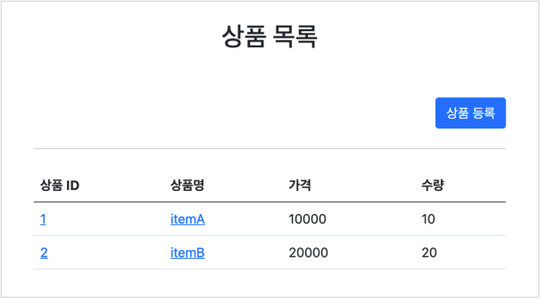

# 로그인 처리 1 - 쿠키, 세션

## 로그인 요구사항

### 홈 화면 - 로그인 전

* 회원 가입
* 로그인

### 홈 화면 - 로그인 후

* 본인 이름 (XX님 환영합니다.)
* 상품 관리
* 로그 아웃

### 보안 요구사항

* 로그인 사용자만 상품에 접근하고, 관리할 수 있음
* 로그인 하지 않은 사용자가 상품 관리에 접근하면 로그인 화면으로 이동

### 회원 가입

### 상품 관리

## 프로젝트 생성

## 홈 화면

## 회원 가입

## 로그인 기능

## 로그인 처리하기 - 쿠키 사용

## 쿠키와 보안 문제

## 로그인 처리하기 - 세션 동작 방식

## 로그인 처리하기 - 세션 직접 만들기

## 로그인 처리하기 - 직접 만든 세션 적용

## 로그인 처리하기 - 서블릿 HTTP 세션 1

## 로그인 처리하기 - 서블릿 HTTP 세션 2

## 세션 정보와 타임아웃 설정