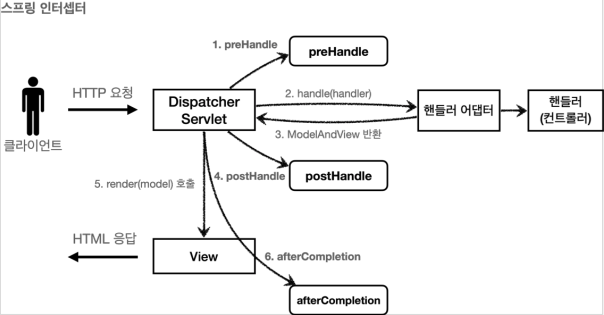
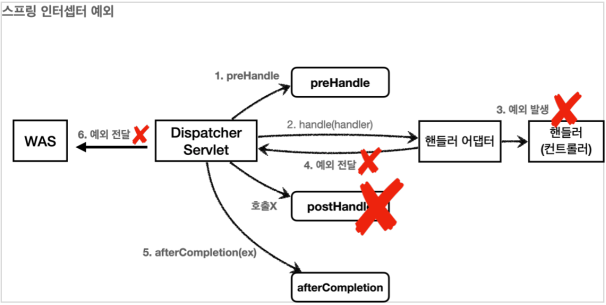

# 로그인 처리 2 - 필터, 인터셉터

## 서블릿 필터 - 소개

### 공통 관심 사항

요구사항을 보면 로그인 한 사용자만 상품 관리 페이지에 들어갈 수 있어야 한다.
앞에서 로그인을 하지 않은 사용자에게는 상품 관리 버튼이 보이지 않기 때문에 문제가 없어 보인다.
그런데 문제는 로그인 하지 않은 사용자도 다음 URL을 직접 호출하면 상품 관리 화면에 들어갈 수 있다는 점이다.

* http://localhost:8080/items

상품 관리 컨트롤러에서 로그인 여부를 체크하는 로직을 하나하나 작성하면 되겠지만,
등록, 수정, 삭제, 조회 등등 상품관리의 모든 컨트롤러 로직에 공통으로 로그인 여부를 확인해야 한다.
더 큰 문제는 향후 로그인과 관련된 로직이 변경될 때 이다.
작성한 모든 로직을 다 수정해야 할 수 있다.

이렇게 애플리케이션 여러 로직에서 공통으로 관심이 있는 있는 것을 공통 관심사(cross-cutting concern)라고 한다.
여기서는 등록, 수정, 삭제, 조회 등등 여러 로직에서 공통으로 인증에 대해서 관심을 가지고 있다.

이러한 공통 관심사는 스프링의 AOP로도 해결할 수 있지만,
웹과 관련된 공통 관심사는 지금부터 설명할 서블릿 필터 또는 스프링 인터셉터를 사용하는 것이 좋다.
웹과 관련된 공통 관심사를 처리할 때는 HTTP의 헤더나 URL의 정보들이 필요한데,
서블릿 필터나 스프링 인터셉터는 `HttpServletRequest`를 제공한다.

### 서블릿 필터 - 소개

필터는 서블릿이 지원하는 수문장이다. 필터의 특성은 다음과 같다.

#### 필터 흐름

```
HTTP 요청 -> WAS -> 필터 -> 서블릿 -> 컨트롤러
```

필터를 적용하면 필터가 호출된 다음에 서블릿이 호출된다.
그래서 모든 고객의 요청 로그를 남기는 요구사항이 있다면 필터를 사용하면 된다.
참고로, 필터는 URL 패턴에 적용할 수 있다.
`/*`라고 하면 모든 요청에 필터가 적용된다.

참고로 스프링을 사용하는 경우 여기서 말하는 서블릿은 `DispatcherServlet`이다.

#### 필터 제한

```
HTTP 요청 -> WAS -> 필터 (적절한 요청이라 판단) -> 서블릿 -> 컨트롤러
HTTP 요청 -> WAS -> 필터 (적절하지 않은 요청이라 판단, 예외 발생) -> WAS
```

필터에서 적절하지 않은 요청이라 판단하면 예외를 발생시킬 수 있다.
그래서 로그인 여부를 체크하기에 딱 좋다.

#### 필터 체인

```
HTTP 요청 -> WAS -> 필터 1 -> 필터 2 -> 필터 3 -> ... -> 서블릿 -> 컨트롤러
```

필터는 체인으로 구성되는데, 중간에 필터를 자유롭게 추가할 수 있다.
예를 들어서 로그를 남기는 필터를 먼저 적용하고, 그 다음에 로그인 여부를 체크하는 필터를 만들 수 있다.

#### 필터 인터페이스

```java
package jakarta.servlet;

public interface Filter {
    /**
     * 필터 초기화 메서드
     * 서블릿 컨테이너가 생성될 때 호출된다.
     */
    public default void init(
            FilterConfig filterConfig
    ) throws ServletException {}

    /**
     * 고객의 요청이 올 때 마다 해당 메서드가 호출된다.
     * 필터의 로직을 구현하면 된다.
     */
    public void doFilter(
            ServletRequest request,
            ServletResponse response,
            FilterChain chain
    ) throws IOException, ServletException;

    /**
     * 필터 종료 메서드
     * 서블릿 컨테이너가 종료될 때 호출된다.
     */
    public default void destroy() {}
}
```

필터 인터페이스를 구현하고 등록하면 서블릿 컨테이너가 필터를 싱글톤 객체로 생성하고, 관리한다

* `init()`
    * 필터 초기화 메서드
    * 서블릿 컨테이너가 생성될 때 호출된다.
* `doFilter()`
    * 고객의 요청이 올 때 마다 해당 메서드가 호출된다.
    * 필터의 로직을 구현하면 된다.
* `destroy()`
    * 필터 종료 메서드
    * 서블릿 컨테이너가 종료될 때 호출된다.

## 서블릿 필터 - 요청 로그

필터가 정말 수문장 역할을 잘 하는지 확인하기 위해 가장 단순한 필터인,
모든 요청을 로그로 남기는 필터를 개발하고 적용해보자.

### LogFilter

```java
@Slf4j
public class LogFilter implements Filter {
    @Override
    public void init(
            FilterConfig filterConfig
    ) throws ServletException {
        log.info("log filter init");
    }

    @Override
    public void destroy() {
        log.info("log filter destroy");
    }

    @Override
    public void doFilter(
            ServletRequest request,
            ServletResponse response,
            FilterChain chain
    ) throws IOException, ServletException {
        log.info("log filter doFilter");

        HttpServletRequest req = (HttpServletRequest) request;
        String requestURI = req.getRequestURI();

        String uuid = UUID.randomUUID().toString();

        try {
            log.info("REQUEST [{}][{}]", uuid, requestURI);
            chain.doFilter(request, response);
        } catch (Exception e) {
            log.error("Filter Error: [{}]", (Object) e.getStackTrace());
            throw e;
        } finally {
            log.info("RESPONSE [{}][{}]", uuid, requestURI);
        }
    }
}
```

* `public class LogFilter implements Filter {}`
    * 필터를 사용하려면 필터 인터페이스를 구현해야 한다.
* `doFilter(ServletRequest request, ServletResponse response, FilterChain chain)`
    * HTTP 요청이 오면 `doFilter`가 호출된다.
    * `ServletRequest request`는 HTTP 요청이 아닌 경우까지 고려해서 만든 인터페이스이다.
    * HTTP를 사용하면` HttpServletRequest httpRequest = (HttpServletRequest) request;` 와 같이 다운 케스팅 하면 된다.
* `String uuid = UUID.randomUUID().toString();`
    * HTTP 요청을 구분하기 위해 요청당 임의의 `uuid`를 생성해둔다.
* `log.info("REQUEST [{}][{}]", uuid, requestURI);`
    * `uuid`와 `requestURI`를 출력한다.
* `chain.doFilter(request, response);`
    * 이 부분이 가장 중요하다. 다음 필터가 있으면 필터를 호출하고, 필터가 없으면 서블릿을 호출한다.
    * 만약 이 로직을 호출하지 않으면 다음 단계로 진행되지 않는다.

### WebConfig - 필터 설정

```java
@Configuration
public class WebConfig {
    @Bean
    public FilterRegistrationBean<Filter> logFilter() {
        FilterRegistrationBean<Filter> bean = new FilterRegistrationBean<>();

        bean.setFilter(new LogFilter());
        bean.setOrder(1);
        bean.addUrlPatterns("/*");

        return bean;
    }
}
```

필터를 등록하는 방법은 여러가지가 있지만,
스프링 부트를 사용한다면 `FilterRegistrationBean`을 사용해서 등록하면 된다.

* `setFilter(new LogFilter())`
    * 등록할 필터를 지정한다.
* `setOrder(1)`
    * 필터는 체인으로 동작한다.
    * 따라서 순서가 필요하다. 낮을 수록 먼저 동작한다.
* `addUrlPatterns("/*")`
    * 필터를 적용할 URL 패턴을 지정한다.
    * 한번에 여러 패턴을 지정할 수 있다.

> **참고**<br>
> `@ServletComponentScan @WebFilter(filterName = "logFilter", urlPatterns = "/*")`로 필터 등록이 가능하지만 필터 순서 조절이 안된다.
> 따라서 `FilterRegistrationBean`을 사용하자.

### 결과

```
log filter: doFilter
REQUEST [b749cdf1-677d-46a3-b661-b43f3e36f4a6][/login]
LoginService: 'test', 'test!'
login? Member(id=1, loginId=test, name=테스터, password=test!)
RESPONSE [b749cdf1-677d-46a3-b661-b43f3e36f4a6][/login]
```

> **참고**<br>
> 실무에서 HTTP 요청시 같은 요청의 로그에 모두 같은 식별자를 자동으로 남기는 방법은 **logback mdc**로 검색해보자.

## 서블릿 필터 - 인증 체크

드디어 인증 체크 필터를 개발해보자.
로그인 되지 않은 사용자는 상품 관리 뿐만 아니라 미래에 개발될 페이지에도 접근하지 못하도록 하자.

### LoginCheckFilter

```java
@Slf4j
public class LoginCheckFilter implements Filter {
    private static final String[] whitelist = {"/", "/members/add", "/login", "/logout", "/css/*"};

    @Override
    public void doFilter(
            ServletRequest request,
            ServletResponse response,
            FilterChain chain
    ) throws IOException, ServletException {
        HttpServletRequest req = (HttpServletRequest) request;
        HttpServletResponse resp = (HttpServletResponse) response;

        String requestURI = req.getRequestURI();

        try {
            log.info("인증 체크 필터 시작 {}", requestURI);

            if (isLoginCheckPath(requestURI)) {
                log.info("인증 체크 로직 실행 {}", requestURI);

                HttpSession session = req.getSession(false);
                if (session == null || session.getAttribute(SessionConst.LOGIN_MEMBER) == null) {
                    log.info("미인증 사용자 요청 {}", requestURI);
                    resp.sendRedirect("/login?redirectURL=" + requestURI);
                    return;
                }
            }
            
            chain.doFilter(request, response);
        } catch (Exception e) {
            // 예외 로깅 가능하지만, 톰캣까지 예외를 보내주어야함.
            log.error(e.getStackTrace().toString());
            throw e;
        } finally {
            log.info("인증 체크 필터 종료 {}", requestURI);
        }
    }

    /**
     * 화이트 리스트 검사
     */
    private boolean isLoginCheckPath(
            String requestURI
    ) {
        return !PatternMatchUtils.simpleMatch(whitelist, requestURI);
    }
}
```

* `whitelist = {"/", "/members/add", "/login", "/logout","/css/*"};`
    * 인증 필터를 적용해도 홈, 회원가입, 로그인 화면, css 같은 리소스에는 접근할 수 있어야 한다.
    * 이렇게 화이트 리스트 경로는 인증과 무관하게 항상 허용한다.
    * 화이트 리스트를 제외한 나머지 모든 경로에는 인증 체크 로직을 적용한다.
* `isLoginCheckPath(requestURI)`
    * 화이트 리스트를 제외한 모든 경우에 인증 체크 로직을 적용한다.
* `httpResponse.sendRedirect("/login?redirectURL=" + requestURI);`
    * 미인증 사용자는 로그인 화면으로 리다이렉트 한다.
    * 그런데 로그인 이후에 다시 홈으로 이동해버리면, 원하는 경로를 다시 찾아가야 하는 불편함이 있다.
    * 예를 들어서 상품 관리 화면을 보려고 들어갔다가 로그인 화면으로 이동하면, 로그인 이후에 다시 상품 관리 화면으로 들어가는 것이 좋다.
    * 이런 부분이 개발자 입장에서는 좀 귀찮을 수 있어도 사용자 입장으로 보면 편리한 기능이다.
    * 이러한 기능을 위해 현재 요청한 경로인 `requestURI`를 `/login`에 쿼리 파라미터로 함께 전달한다.
    * 물론 `/login`컨트롤러에서 로그인 성공시 해당 경로로 이동하는 기능은 추가로 개발해야 한다.
* `return;`
    * 여기가 중요하다. 필터를 더는 진행하지 않는다.
    * 이후 필터는 물론 서블릿, 컨트롤러가 더는 호출되지 않는다.
    * 앞서 `redirect`를 사용했기 때문에 `redirect`가 응답으로 적용되고 요청이 끝난다

### WebConfig

```java
@Bean
public FilterRegistrationBean<Filter> loginCheckFilter() {
    FilterRegistrationBean<Filter> bean = new FilterRegistrationBean<>();

    bean.setFilter(new LoginCheckFilter());
    bean.setOrder(2);
    bean.addUrlPatterns("/*");

    return bean;
}
```

* `setFilter(new LoginCheckFilter())`
    * 로그인 필터를 등록한다.
* `setOrder(2)`
    * 순서를 2번으로 잡았다. 로그 필터 다음에 로그인 필터가 적용된다.
* `addUrlPatterns("/*")`
    * 모든 요청에 로그인 필터를 적용한다.

### 결과 - `/items`로 미인증 요청시,

```
REQUEST [e3bb04dd-0ee9-4e10-9d17-2ebbb55c0b07][/items]
인증 체크 필터 시작 /items
인증 체크 로직 실행 /items
미인증 사용자 요청 /items
인증 체크 필터 종료 /items
RESPONSE [e3bb04dd-0ee9-4e10-9d17-2ebbb55c0b07][/items]

REQUEST [5bfed263-1544-4be8-9391-0e026070e2c6][/login]
인증 체크 필터 시작 /login
인증 체크 필터 종료 /login
RESPONSE [5bfed263-1544-4be8-9391-0e026070e2c6][/login]
```

```
URL: http://localhost:8080/login?redirectURL=/items
```

### LoginController

```java
@PostMapping("/login")
public String login(
        @RequestParam(defaultValue = "/") String redirectURL,
        @Validated @ModelAttribute("loginForm") LoginDto form,
        BindingResult bindingResult,
        HttpServletRequest req
) {
    if (bindingResult.hasErrors()) {
        return "login/loginForm";
    }

    // 로그인 시도
    Member loginMember = loginService.login(form.getLoginId(), form.getPassword());
    log.info("login? {}", loginMember);

    // 로그인 실패 시
    if (loginMember == null) {
        bindingResult.reject("loginFail", "아이디 또는 비밀번호가 맞지 않습니다.");
        return "login/loginForm";
    }

    // 로그인 성공 처리 - HttpSession 사용
    HttpSession session = req.getSession();
    // 세션에 로그인 회원 정보 보관
    session.setAttribute(SessionConst.LOGIN_MEMBER, loginMember);

    return "redirect:" + redirectURL;
}
```

로그인 체크 필터에서, 미인증 사용자는 요청 경로를 포함해서 `/login`에 `redirectURL`요청 파라미터를 추가해서 요청했다.
이 값을 사용해서 로그인 성공시 해당 경로로 고객을 `redirect`한다.

### 정리

서블릿 필터를 잘 사용한 덕분에 로그인 하지 않은 사용자는 나머지 경로에 들어갈 수 없게 되었다.
공통 관심사를 서블릿 필터를 사용해서 해결한 덕분에 향후 로그인 관련 정책이 변경되어도 이 부분만 변경하면 된다.

> **참고**<br>
> 필터에는 다음에 설명할 스프링 인터셉터는 제공하지 않는, 아주 강력한 기능이 있는데
> `chain.doFilter(request, response);`를 호출해서 다음 필터 또는 서블릿을 호출할 때
> `request`, `response`를 다른 객체로 바꿀 수 있다.
>
> `ServletRequest`, `ServletResponse`를 구현한 다른 객체를 만들어서 넘기면 해당 객체가 다음 필터 또는 서블릿에서 사용된다.
> 잘 사용하는 기능은 아니니 참고만 해두자.

## 스프링 인터셉터 - 소개

스프링 인터셉터도 서블릿 필터와 같이 웹과 관련된 공통 관심 사항을 효과적으로 해결할 수 있는 기술이다.
서블릿 필터가 서블릿이 제공하는 기술이라면, **스프링 인터셉터는 스프링 MVC가 제공**하는 기술이다.
둘다 웹과 관련된 공통 관심 사항을 처리하지만, 적용되는 순서와 범위, 그리고 사용방법이 다르다.

### 스프링 인터셉터 흐름

```
HTTP 요청 -> WAS -> 필터 -> 서블릿 -> 인터셉터 -> 컨트롤러
```

* 스프링 인터셉터는 디스패처 서블릿과 컨트롤러 사이에서 컨트롤러 호출 직전에 호출 된다.
* 스프링 인터셉터는 스프링 MVC가 제공하는 기능이기 때문에 결국 디스패처 서블릿 이후에 등장하게 된다.
    * 스프링 MVC의 시작점이 디스패처 서블릿이라고 생각해보면 이해가 될 것이다.
* 스프링 인터셉터에도 URL 패턴을 적용할 수 있는데, 서블릿 URL 패턴과는 다르고, 매우 정밀하게 설정할 수 있다.

### 스프링 인터셉터 제한

```
HTTP 요청 -> WAS -> 필터 -> 서블릿 -> 인터셉터 -> 컨트롤러
HTTP 요청 -> WAS -> 필터 -> 서블릿 -> 인터셉터 (적절하지 않은 요청이라 판단, 컨트롤러 호출 X)
```

* 인터셉터에서 적절하지 않은 요청이라고 판단하면 거기에서 끝을 낼 수도 있다.
* 그래서 로그인 여부를 체크하기에 딱 좋다.

### 스프링 인터셉터 체인

```
HTTP 요청 -> WAS -> 필터 -> 서블릿 -> 인터셉터 1 -> 인터셉터 2 -> ... -> 컨트롤러
```

스프링 인터셉터는 체인으로 구성되는데, 중간에 인터셉터를 자유롭게 추가할 수 있다.
예를 들어서 로그를 남기는 인터셉터를 먼저 적용하고, 그 다음에 로그인 여부를 체크하는 인터셉터를 만들 수 있다.

지금까지 내용을 보면 서블릿 필터와 호출 되는 순서만 다르고, 제공하는 기능은 비슷해 보인다.
앞으로 설명하겠지만, 스프링 인터셉터는 서블릿 필터보다 편리하고, 더 정교하고 다양한 기능을 지원한다.

### 스프링 인터셉터 인터페이스 - HandlerInterceptor

```java
public interface HandlerInterceptor {
    /**
     * 호출 전
     * false 인 경우 나머지 인터셉터는 물론이고, 핸들러 어댑터도 호출되지 않는다.
     *
     * @return true = 다음으로 진행, false = 진행 멈춤.
     */
    default boolean preHandle(
            HttpServletRequest request,
            HttpServletResponse response,
            Object handler
    ) throws Exception { return true; }

    /**
     * 호출 후
     * 더 정확히는 핸들러 어댑터 호출 후에 호출된다.
     */
    default void postHandle(
            HttpServletRequest request,
            HttpServletResponse response,
            Object handler,
            @Nullable ModelAndView modelAndView
    ) throws Exception { }

    /**
     * 요청 완료 이후
     * 뷰가 렌더링 된 이후에 호출된다.
     */
    default void afterCompletion(
            HttpServletRequest request,
            HttpServletResponse response,
            Object handler,
            @Nullable Exception ex
    ) throws Exception { }
}
```

### 스프링 인터셉터 호출 흐름



* 서블릿 필터의 경우 단순하게 `doFilter()` 하나만 제공된다.
    * 인터셉터는 컨트롤러 호출 전(`preHandle`), 호출 후(`postHandle`), 요청 완료 이후(`afterCompletion`)와 같이 단계적으로 잘 세분화 되어 있다.
* 서블릿 필터의 경우 단순히 `request`, `response`만 제공했지만, 인터셉터는 어떤 컨트롤러(`handler`)가 호출되는지 호출 정보도 받을 수 있다.
    * 그리고 어떤 `modelAndView`가 반환되는지 응답 정보도 받을 수 있다

### 정상 흐름

* `preHandle`
    * 컨트롤러 호출 전에 호출된다. (더 정확히는 핸들러 어댑터 호출 전에 호출된다.)
    * `preHandle`의 응답값이 `true`이면 다음으로 진행하고, `false`이면 더는 진행하지 않는다.
    * `false`인 경우 나머지 인터셉터는 물론이고, 핸들러 어댑터도 호출되지 않는다.
    * 그림에서 1번에서 끝이 나버린다.
* `postHandle`
    * 컨트롤러 호출 후에 호출된다. (더 정확히는 핸들러 어댑터 호출 후에 호출된다.)
* `afterCompletion`
    * 뷰가 렌더링 된 이후에 호출된다.

### 스프링 인터펩터 예외 상황



#### 예외 발생시

* `preHandle`
    * 컨트롤러 호출 전에 호출된다.
* `postHandle`
    * 컨트롤러에서 예외가 발생하면 postHandle은 호출되지 않는다.
* `afterCompletion`
    * afterCompletion은 항상 호출된다.
    * 이 경우 예외(`ex`)를 파라미터로 받아서 어떤 예외가 발생했는지 로그로 출력할 수 있다

#### afterCompletion은 예외가 발생해도 호출된다.

* 예외가 발생하면 `postHandle()`은 호출되지 않으므로 예외와 무관하게 공통 처리를 하려면 `afterCompletion()`을 사용해야 한다.
* 예외가 발생하면 `afterCompletion()`에 예외 정보(`ex`)를 포함해서 호출된다.

### 정리

인터셉터는 스프링 MVC 구조에 특화된 필터 기능을 제공한다고 이해하면 된다.
스프링 MVC를 사용하고, 특별히 필터를 꼭 사용해야 하는 상황이 아니라면 인터셉터를 사용하는 것이 더 편리하다.

## 스프링 인터셉터 - 요청 로그

### LogInterceptor

```java
@Slf4j
public class LogInterceptor implements HandlerInterceptor {
    public static final String LOG_ID = "logId";

    @Override
    public boolean preHandle(
            HttpServletRequest request,
            HttpServletResponse response,
            Object handler
    ) throws Exception {
        String requestURI = request.getRequestURI();
        String uuid = UUID.randomUUID().toString();
        request.setAttribute(LOG_ID, uuid);

        // @RequestMapping: HandlerMethod
        // 정적 리소스: ResourceHttpRequestMethod
        if (handler instanceof HandlerMethod) {
            // 호출할 컨트롤러 메서드의 모든 정보가 포함되어 있다.
            HandlerMethod hm = (HandlerMethod) handler;
        }

        log.info("[{}][{}] LogInterceptor preHandle", requestURI, uuid);
        return true;
    }

    @Override
    public void postHandle(
            HttpServletRequest request,
            HttpServletResponse response,
            Object handler,
            ModelAndView modelAndView
    ) throws Exception {
        String requestURI = request.getRequestURI();
        String uuid = (String) request.getAttribute(LOG_ID);

        log.info("[{}][{}] LogInterceptor postHandle", requestURI, uuid);
    }

    @Override
    public void afterCompletion(
            HttpServletRequest request,
            HttpServletResponse response,
            Object handler,
            Exception ex
    ) throws Exception {
        String requestURI = request.getRequestURI();
        String uuid = (String) request.getAttribute(LOG_ID);

        log.info("[{}][{}] LogInterceptor afterComplete", requestURI, uuid);

        if (ex != null) {
            log.error("LogInterceptor afterComplete Error: ", ex);
            ex.printStackTrace();
        }
    }
}
```

* `String uuid = UUID.randomUUID().toString()`
    * 요청 로그를 구분하기 위한 uuid 를 생성한다.
* `request.setAttribute(LOG_ID, uuid)`
    * 서블릿 필터의 경우 지역변수로 해결이 가능하지만, 스프링 인터셉터는 호출 시점이 완전히 분리되어있다.
    * 따라서 `preHandle`에서 지정한 값을 `postHandle`, `afterCompletion`에서 함께 사용하려면 어딘가에 담아두어야 한다.
    * `LogInterceptor`도 싱글톤 처럼 사용되기 때문에 맴버변수를 사용하면 위험하다. 따라서 `request`에 담아두었다.
    * 이 값은 `afterCompletion`에서 `request.getAttribute(LOG_ID)`로 찾아서 사용한다.
* `return true`
    * `true`면 정상 호출이다.
    * 다음 인터셉터나 컨트롤러가 호출된다.

#### HandlerMethod

```java
if (handler instanceof HandlerMethod) {
    // 호출할 컨트롤러 메서드의 모든 정보가 포함되어 있다.
    HandlerMethod hm = (HandlerMethod) handler;
}
```

핸들러 정보는 어떤 핸들러 매핑을 사용하는가에 따라 달라진다.
스프링을 사용하면 일반적으로 `@Controller` , `@RequestMapping`을 활용한 핸들러 매핑을 사용하는데,
이 경우 핸들러 정보로 `HandlerMethod`가 넘어온다.

#### ResourceHttpRequestHandler

`@Controller`가 아니라 `/resources/static`와 같은 정적 리소스가 호출 되는 경우
`ResourceHttpRequestHandler`가 핸들러 정보로 넘어오기 때문에 타입에 따라서 처리가 필요하다.

#### postHandle, afterCompletion

종료 로그를 `postHandle`이 아니라 `afterCompletion`에서 실행한 이유는, 예외가 발생한 경우 `postHandle`가 호출되지 않기 때문이다.
`afterCompletion`은 예외가 발생해도 호출 되는 것을 보장한다.

### InterceptorConfig

```java
@Configuration
public class InterceptorConfig implements WebMvcConfigurer {
    @Override
    public void addInterceptors(InterceptorRegistry registry) {
        registry.addInterceptor(new LogInterceptor())
                .order(1)                                             // 우선 순위
                .addPathPatterns("/**")                               // 모두 허용
                .excludePathPatterns("/css/**", "/*.ico", "/error");  // BlackList
    }
}
```

* `addInterceptors`
    * `WebMvcConfigurer`가 제공하는 `addInterceptors()`를 사용해서 인터셉터를 등록할 수 있다.

* `registry.addInterceptor(new LogInterceptor())`
    * 인터셉터를 등록한다.
* order(1)
    * 인터셉터의 호출 순서를 지정한다. 낮을 수록 먼저 호출된다.
* `addPathPatterns("/**")`
    * 인터셉터를 적용할 URL 패턴을 지정한다.
* `excludePathPatterns("/css/**", "/*.ico", "/error")`
    * 인터셉터에서 제외할 패턴을 지정한다.

필터와 비교해보면 인터셉터는 `addPathPatterns`, `excludePathPatterns`로 매우 정밀하게 URL 패턴을 지정할 수 있다.

### 결과

```
h.springcoremvc26.web.filter.LogFilter   : log filter: doFilter
h.springcoremvc26.web.filter.LogFilter   : REQUEST [f57d04f2-85b0-4cd7-bfef-38c157e71c97][/]
h.s.web.filter.LoginCheckFilter          : 인증 체크 필터 시작 /
h.s.web.interceptor.LogInterceptor       : preHandle [c5a5dc1e-9026-432d-b0aa-798e343e3f46][/][hello.springcoremvc26.web.HomeController#homeLogin(Member, Model)]
h.s.web.interceptor.LogInterceptor       : postHandle [c5a5dc1e-9026-432d-b0aa-798e343e3f46][/][ModelAndView [view="home"; model={}]]
h.s.web.interceptor.LogInterceptor       : afterComplete [c5a5dc1e-9026-432d-b0aa-798e343e3f46][/][hello.springcoremvc26.web.HomeController#homeLogin(Member, Model)]
h.s.web.filter.LoginCheckFilter          : 인증 체크 필터 종료 /
h.springcoremvc26.web.filter.LogFilter   : RESPONSE [f57d04f2-85b0-4cd7-bfef-38c157e71c97][/]
```

### 스프링의 URL 경로

스프링이 제공하는 URL 경로는 서블릿 기술이 제공하는 URL 경로와 완전히 다르다.
더욱 자세하고, 세밀하게 설정할 수 있다.

#### [PathPattern 공식 문서](https://docs.spring.io/spring-framework/docs/current/javadoc-api/org/springframework/web/util/pattern/PathPattern.html)

* `?`: 한 문자 일치
    * `/pages/t?st.html`
        * YES: `/pages/test.html`, `/pages/tXst.html`
        * NO : `/pages/toast.html`
* `*`: 경로(/) 안에서 0개 이상의 문자 일치
    * `/resources/*.png`
        * YES: `/resources/photo.png`
        * NO : `/resources/favority.ico`
* `**`: 현재 경로 + 하위 경로에서 0개 이상의 문자 일치
    * `/resources/**`
        * YES: `/resources/image.png`, `/resources/css/spring.css`
* `{spring}`: 경로 일치 + spring 이라는 변수로 캡처
    * `/resources/{path}`
        * `/resources/robot.txt` -> `path`변수에 "robot.txt" 할당
        * `@PathVariable("path")`로 접근 가능
* `{*spring}`: 하위 경로 끝까지 `spring`변수에 캡쳐
    * `/items/{*path}`
        * `/items/1/add` -> `path`변수에 "/1/add" 할당
* `{spring:[a-z]+}`: 정규식 이용
    * `/items/{path:[a-z]+}`
        * YES: `/items/robots`
        * NO : `/items/123`

#### 예제 1 - `{*spring}`

```java
@GetMapping("/hello/{*name}")
@ResponseBody
public String handleTest(
        @PathVariable String name
) {
    log.info("name = " + name);
    return name;
}
```

```
===

GET http://localhost:8080/hello/path-test
->
name = /path-test

===

GET http://localhost:8080/hello/path-test/other
->
name = /path-test/other

===
```

#### 예제 2 - 정규식

```java
@GetMapping("/static/{name:[a-z-]+}-{version:\\d\\.\\d\\.\\d}{ext:\\.[a-z]+}")
@ResponseBody
public String handle(
        @PathVariable String name, 
        @PathVariable String version, 
        @PathVariable String ext
) {
    log.info("name = " + name);
    log.info("version = " + version);
    log.info("ext = " + ext);
    
    return "/" + name + "/" + version + "/" + ext;
}
```

```
GET http://localhost:8080/pathtest-1.0.0.jar
->
name = pathtest
version = 1.0.0
ext = .jar
```

## 스프링 언터셉터 - 인증 체크

### LoginCheckInterceptor

```java
@Slf4j
public class LoginCheckInterceptor implements HandlerInterceptor {
    @Override
    public boolean preHandle(
            HttpServletRequest request,
            HttpServletResponse response,
            Object handler
    ) throws Exception {
        String requestURI = request.getRequestURI();
        String uuid = (String) request.getAttribute(LogInterceptor.LOG_ID);
        log.info("[{}][{}] LoginCheckInterceptor preHandle", requestURI, uuid);

        HttpSession session = request.getSession();
        if (session == null || session.getAttribute(SessionConst.LOGIN_MEMBER) == null) {
            log.info("미인증 사용자 요청 {}", requestURI);
            response.sendRedirect("/login?redirectURL=" + requestURI);
            return false;
        }

        return true;
    }

    @Override
    public void postHandle(
            HttpServletRequest request,
            HttpServletResponse response,
            Object handler,
            ModelAndView modelAndView
    ) throws Exception {
        String requestURI = request.getRequestURI();
        String uuid = (String) request.getAttribute(LogInterceptor.LOG_ID);

        log.info("[{}][{}] LoginCheckInterceptor postHandle", requestURI, uuid);
    }

    @Override
    public void afterCompletion(
            HttpServletRequest request,
            HttpServletResponse response,
            Object handler,
            Exception ex
    ) throws Exception {
        String requestURI = request.getRequestURI();
        String uuid = (String) request.getAttribute(LogInterceptor.LOG_ID);

        log.info("[{}][{}] LoginCheckInterceptor afterCompletion", requestURI, uuid);
    }
}
```

서블릿 필터와 비교해서 코드가 매우 간결하다.
인증이라는 것은 컨트롤러 호출 전에만 호출되면 된다.
따라서 `preHandle`만 구현하면 된다.

### InterceptorConfig

```java
@Configuration
public class InterceptorConfig implements WebMvcConfigurer {
    @Override
    public void addInterceptors(InterceptorRegistry registry) {
        registry.addInterceptor(new LogInterceptor())
                .order(1)
                .addPathPatterns("/**") // 모두 허용
                .excludePathPatterns("/css/**", "/*.ico", "/error"); // BlackList

        registry.addInterceptor(new LoginCheckInterceptor())
                .order(2)
                .addPathPatterns("/**")
                .excludePathPatterns(
                        "/", "/members/css", "/login",
                        "/logout", "/css/**", "*.ico", "/error"
                );
    }
}
```

인터셉터와 필터가 중복되지 않도록 필터를 등록하기 위한 `logFilter()`, `loginCheckFilter()`의 `@Bean`은 주석처리하자.

인터셉터를 적용하거나 하지 않을 부분은 `addPathPatterns`와 `excludePathPatterns`에 작성하면 된다.
기본적으로 모든 경로에 해당 인터셉터를 적용하되 (`/**`),
홈(`/`), 회원가입(`/members/add`), 로그인(`/login`), 리소스 조회(`/css/**`), 오류(`/error`)와 같은 부분은 로그인 체크 인터셉터를 적용하지 않는다.

서블릿 필터와 비교해보면 매우 편리한 것을 알 수 있다.

### 실행 결과

#### 정상 처리

```
// /login 요청
[/login][19bad338-e02d-4bbe-8b3a-5dfc55ad4428] LogInterceptor preHandle
LoginService: 'test', 'test!'
login? Member(id=1, loginId=test, name=테스터, password=test!)
[/login][19bad338-e02d-4bbe-8b3a-5dfc55ad4428] LogInterceptor postHandle
[/login][19bad338-e02d-4bbe-8b3a-5dfc55ad4428] LogInterceptor afterComplete

// Redirect - /items
[/items][679dc279-ff3a-4ee3-a424-26b18ac8dbbd] LogInterceptor preHandle
[/items][679dc279-ff3a-4ee3-a424-26b18ac8dbbd] LoginCheckInterceptor preHandle
[/items][679dc279-ff3a-4ee3-a424-26b18ac8dbbd] LoginCheckInterceptor postHandle
[/items][679dc279-ff3a-4ee3-a424-26b18ac8dbbd] LogInterceptor postHandle
[/items][679dc279-ff3a-4ee3-a424-26b18ac8dbbd] LoginCheckInterceptor afterCompletion
[/items][679dc279-ff3a-4ee3-a424-26b18ac8dbbd] LogInterceptor afterComplete
```

LogInterceptor preHandle -> LoginCheckInterceptor preHandle
-> LoginCheckInterceptor postHandle -> LogInterceptor postHandle
-> LoginCheckInterceptor afterCompletion -> LogInterceptor afterComplete
-> 종료

> **주의!**<br>
> `preHandle`의 경우 `order`에 설정한 대로 호출이 되지만,
> `postHandle`과 `afterCompletion`의 경우 **반대로 호출**이 된다.

#### 미인증 처리

```
// /items 요청
[/items][45e50a37-57a0-4298-b50e-e42141005426] LogInterceptor preHandle
[/items][45e50a37-57a0-4298-b50e-e42141005426] LoginCheckInterceptor preHandle
미인증 사용자 요청 /items
[/items][45e50a37-57a0-4298-b50e-e42141005426] LogInterceptor afterComplete

// Redirect - /login
[/login][18f052ab-b849-4690-83ec-43866660f570] LogInterceptor preHandle
[/login][18f052ab-b849-4690-83ec-43866660f570] LogInterceptor postHandle
[/login][18f052ab-b849-4690-83ec-43866660f570] LogInterceptor afterComplete
```

LogInterceptor preHandle -> LoginCheckInterceptor preHandle -> return false;
-> LogInterceptor afterComplete -> 종료

> **주의!**<br>
> `preHandle`에서 `return false;`을 할 경우(비 정상 리턴), **해당 인터셉터의 `afterComplete`는 호출되지 않는다.**

### 정리

서블릿 필터와 스프링 인터셉터는 웹과 관련된 공통 관심사를 해결하기 위한 기술이다.
서블릿 필터와 비교해서 스프링 인터셉터가 개발자 입장에서 훨씬 편리하다는 것을 코드로 이해했을 것이다.
특별한 문제가 없다면 인터셉터를 사용하는 것이 좋다.

## ArgumentResolver 활용